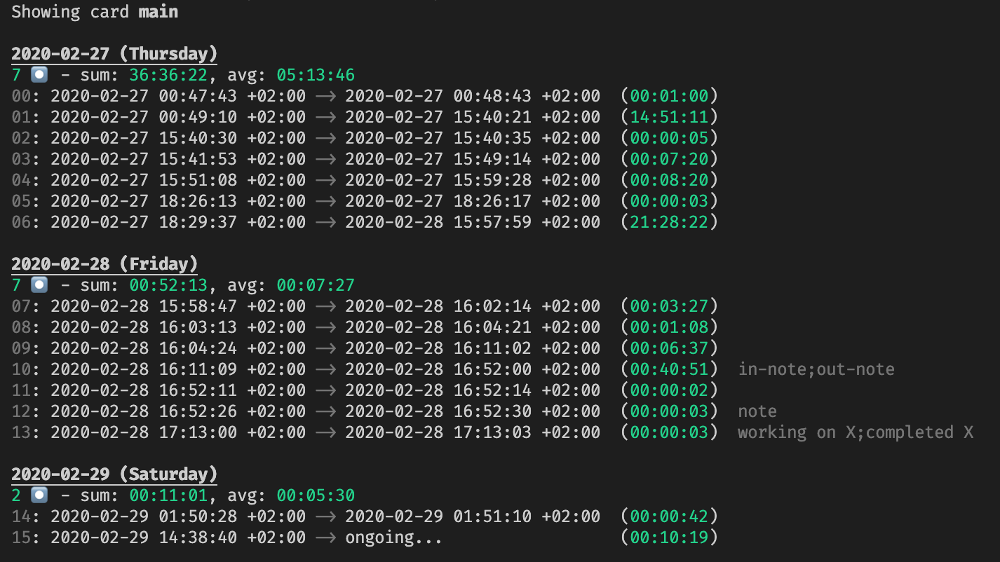

# 👊 `punch`

A simple time-tracking CLI tool written in Rust. Punch in, punch out, and pretty-print records to the terminal in different time granularity.

## How-To

`in`, `out`, `show` - that's all you need:

- **`punch in [<note>]`**: Start tracking time and pass an optional note.
- **`punch out [<note>]`**: Stop tracking time and pass an optional note.
- **`punch show [day|week|month|year] [--precise] [--round DIRECTION,GRANULARITY]`**: Print tracked times and notes grouped by the specified time interval to console. (default: `week`).
    - `--precise/-p`: prints timestamps in RFC 3339 format.
    - `--timezone/-t`: prints timestamps with timezone.
    - `--round/-r DIRECTION,GRANULARITY`: rounds durations according to the given rounding direction and granularity. Examples: `nearest,1min` (default), `up,30min`, `down,1h`, `n,1day`.

Each `punch in` must be followed by a `punch out`. You can't `punch in` if you haven't `punch out`d the previous record. The tool performs some validation on each punch and reports invalid state.

If you punched by mistake, you can manually edit the punch card at any time in `~/.punch/main.csv`. Each record is CSV-encoded by `index,start,[end],[note]`, where `[]` denotes optional fields.

## Example

Running `punch show day` based on some test data:

## Future improvements
- Support multiple punch cards and allow switching between them. E.g. with `punch list` and `punch switch`.
- Tests
- Switch showing stats with `punch show --stats`
- OS-integration would be sweet: Act on shutdown/start/sleep/opening terminal/Slack.
- Print table on `punch show`?
